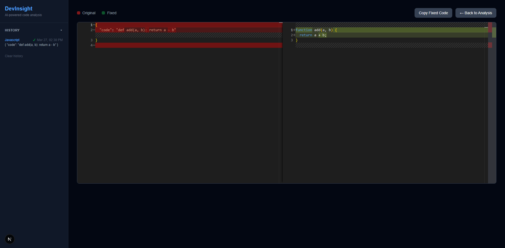

# DevInsight

> AI-powered code analysis tool built with Claude, FastAPI, and Next.js.


## Overview

DevInsight analyzes your code using Claude AI and returns structured feedback — 
what your code does, any bugs or issues, and specific improvement suggestions. 
It can also generate a fixed version of your code with a GitHub-style diff view 
so you can see exactly what changed.

## Features

- **Code Analysis** — Explains what your code does, identifies bugs, and suggests improvements
- **Language Support** — Syntax highlighting for JavaScript, TypeScript, Python, Java, C#, C++, Go, Rust, HTML, and CSS
- **Fix My Code** — Generates a corrected version with a side-by-side diff view
- **Copy to Clipboard** — Copy the fixed code with one click
- **File Upload/Download** — Upload files directly and one-click download of fixed code
- **Analysis History** — Quickly switch between different requests and delete irrelevent ones

## Tech Stack

| Layer | Technology |
|-------|-----------|
| Frontend | Next.js, Tailwind CSS, Monaco Editor |
| Backend | Python, FastAPI |
| AI | Anthropic Claude API |

## Getting Started

Run the startup script from the project root:
```
start.bat
```

Or manually:

**Backend:** `cd backend` → `venv\Scripts\activate` → `uvicorn main:app --reload`  
**Frontend:** `cd frontend` → `npm run dev`

Then open `http://localhost:3000`

### Prerequisites
- Python 3.10+
- Node.js 18+
- Anthropic API key ([get one here](https://console.anthropic.com))

### Backend
```bash
cd backend
python -m venv venv
venv\Scripts\activate       # Windows
source venv/bin/activate    # Mac/Linux
pip install fastapi uvicorn anthropic python-dotenv
```

Create a `.env` file in the `backend/` folder:
```
ANTHROPIC_API_KEY=your_key_here
```

Start the server:
```bash
uvicorn main:app --reload
```

API docs available at: `http://localhost:8000/docs`

### Frontend
```bash
cd frontend
npm install
npm run dev
```

Open `http://localhost:3000` in your browser.

## Project Structure
```
DevInsight/
├── backend/
│   ├── main.py
│   └── .env          # not committed
└── frontend/
    └── app/
        └── page.js
```

